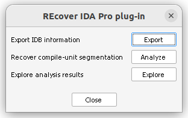
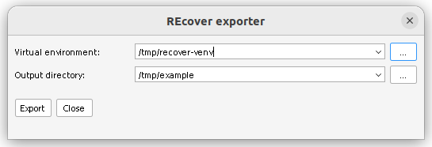
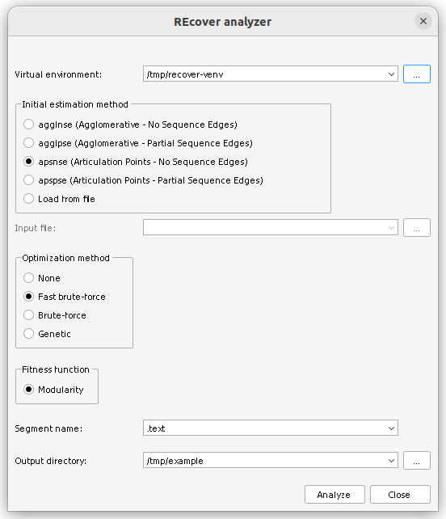
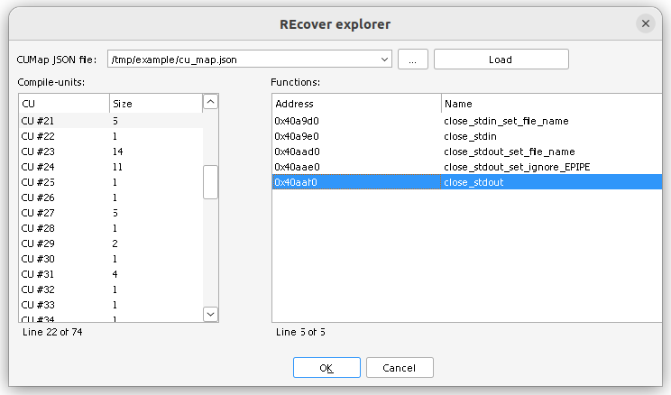

# REcover IDA Pro plug-in

## Installation

REcover depends on [ida-venv](https://github.com/Skwteinopteros/ida-venv), so,
install this first:

    curl -sLo $IDAUSR/plugins/ida_venv.py \
        https://raw.githubusercontent.com/Skwteinopteros/ida-venv/refs/heads/main/ida_venv.py

Then, to install REcover:

    cp recover.py $IDAUSR/plugins

## Using the plug-in

Press Ctrl+Alt+R to open the main UI, or manually navigate to `Edit` &rarr;
`Plugins` &rarr; `REcover`. The main window lists all the actions that comprise
an object-file recovery session, in order, arranged from top to bottom:

To start by exporting program graphs, like the AFCG, DFG and PDG, press `Export`:

The UI requires you to specify the path to a virtual environment, where REcover
has been installed, as well as the directory where output files will be written
to. Note that no directories are automatically created (i.e., paths should
already exist for export to succeed). Press `Export` and wait for the process to
complete (ignore any pop-ups about IDA Pro not responding).

When ready, return to the main UI and click `Analyze`:

Once again, you will need to specify the path to the aforementioned virtual
environment. This is also where you choose the compile-unit estimation and
optimization algorithms to use, as well as the directory where output files will
be placed. When ready click `Analyze` to initiate the recovery analysis.

Once the analysis completes, return to the main UI and start exploring the
generated results. When you click `Explore`, the following dialog appears:

Specify the path to the compile-unit map, generated in the previous step, then
press `Load`. Select a compile-unit on the left pane to view its functions (shown
in the right pane).
